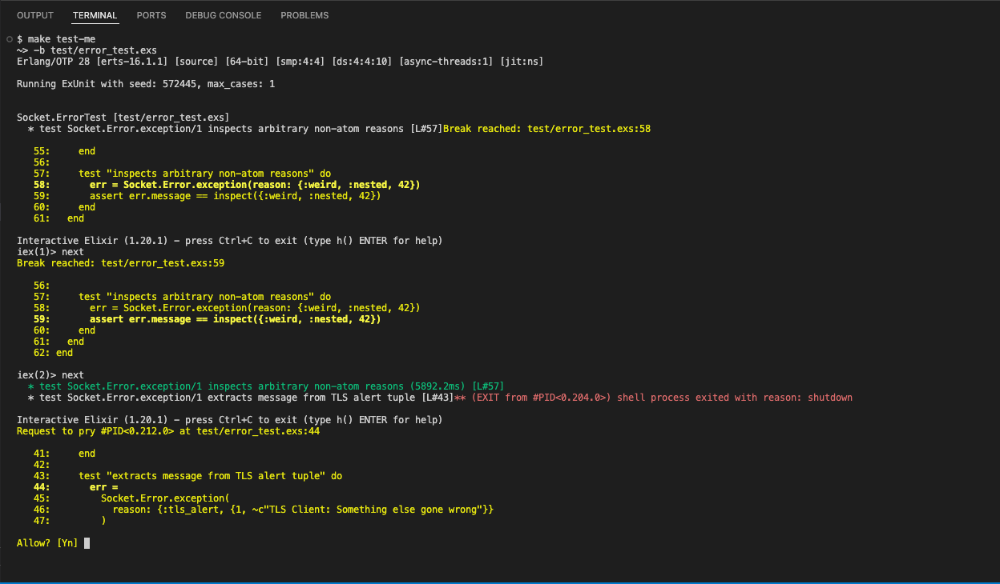
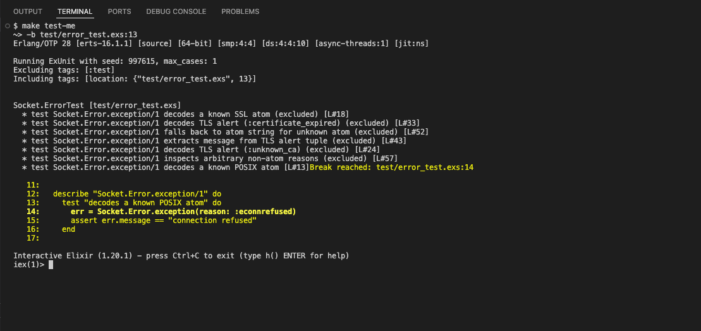

This is a placeholder for any development-process-related information: helpful links, personal observations, hints, tricks, and findings. Feel free to add anything here that you believe is useful for developing and maintaining the project.

### Environment Setup

This project uses [asdf](https://asdf-vm.com) to manage Elixir and Erlang versions. The required versions are pinned in `.tool-versions` at the project root, so asdf will automatically select the right ones once installed.

**1. Install asdf**

Follow the [official installation guide](https://asdf-vm.com/guide/getting-started.html) for your platform, then add the Erlang and Elixir plugins:

```bash
asdf plugin add erlang
asdf plugin add elixir
```

**2. Install the pinned versions**

From the project root, run:

```bash
asdf install
```

asdf reads `.tool-versions` and installs exactly the versions the project expects. This may take a few minutes the first time, as Erlang is compiled from source.

**3. Verify**

```bash
elixir --version
```

You should see Elixir 1.20.1 compiled with OTP 28. If the versions don't match, make sure asdf is initialised in your shell profile (see the asdf getting-started guide).

**4. Install project dependencies**

```bash
make restore
```

### Makefile
To streamline development, testing, formatting, publishing, and other tasks, this repository uses a Makefile to keep all **"tribal knowledge"** commands relevant to the project in a single file. It might look like yet another tool dependency to learn, but to be fair, all commands currently in use are very easy to comprehend if you take a minute or two to read through the Makefile.

All commands that depend on `restore` will fetch dependencies and clear the Hex cache before running (to avoid a pesky `:badfile` error with `~/.hex/cache.ets`).

| Command           | Purpose                                                                                  |
|-------------------|------------------------------------------------------------------------------------------|
| `make restore`    | Fetches project dependencies via `mix deps.get`.                                         |
| `make compile`    | Compiles the project, treating all warnings as errors.                                   |
| `make test`       | Runs the full test suite.                                                                |
| `make test-me`    | Interactive test runner — prompts for arguments and drops into `iex --dbg pry` on failure. |
| `make format`     | Auto-formats source files using `mix format`.                                            |
| `make check-formatted` | Verifies formatting without modifying files. Used in CI.                          |
| `make lint`       | Runs Credo in strict mode for code style and quality checks.                             |
| `make build-plt`  | Builds the Dialyzer PLT (Persistent Lookup Table). Run this once before `make dialyzer`. |
| `make dialyzer`   | Runs Dialyzer type analysis with GitHub-Actions and dialyxir output formatters.          |
| `make docs`       | Generates project documentation via ExDoc.                                               |
| `make clean`      | Removes build artifacts for dependencies no longer listed in `mix.exs` and drops their entries from `mix.lock`.                                            |
| `make validate`   | Runs the full validation suite (mirrors CI): format check, clean, lint, compile, test, dialyzer, docs. |

### Dialyzer / Typespecs
Some extremely useful resources to get up to speed on typespecs in Elixir and Erlang:

- [Specifications and types](https://elixirschool.com/en/lessons/advanced/typespec) — Elixir School
- [Typespecs reference](https://elixir.hexdocs.pm/typespecs.html) — HexDocs (Elixir v1.20.2)
- [Types and Function Specifications](https://www.erlang.org/doc/system/typespec.html) — Erlang System Documentation
- [Dialyzer, or how I learned to stop worrying and love the cryptic error messages](https://www.alanvardy.com/post/dialyzer-stop-worrying) — Alan Vardy
- [Type Specifications and Erlang](https://learnyousomeerlang.com/dialyzer) — Learn You Some Erlang for Great Good!

### Notes on using `make test-me`
This command is a poor man's attempt to avoid remembering all arcane parameters and arguments you need to specify when looking for a way to run a test suite or an individual test under a debugger.

Here is an example of how to use it to debug an entire test suite; the breakpoint will fire for each test in the suite, stopping on the first line of each test:

```bash
$ make test-me
~> -b test/error_test.exs
```


And here is an example of how to use it to debug a unit test:

```bash
$ make test-me
~> -b test/error_test.exs:13
```


You can also pass any other parameters that `mix test` supports to get the desired behavior. One caveat: `--trace` is already specified in the `Makefile`.